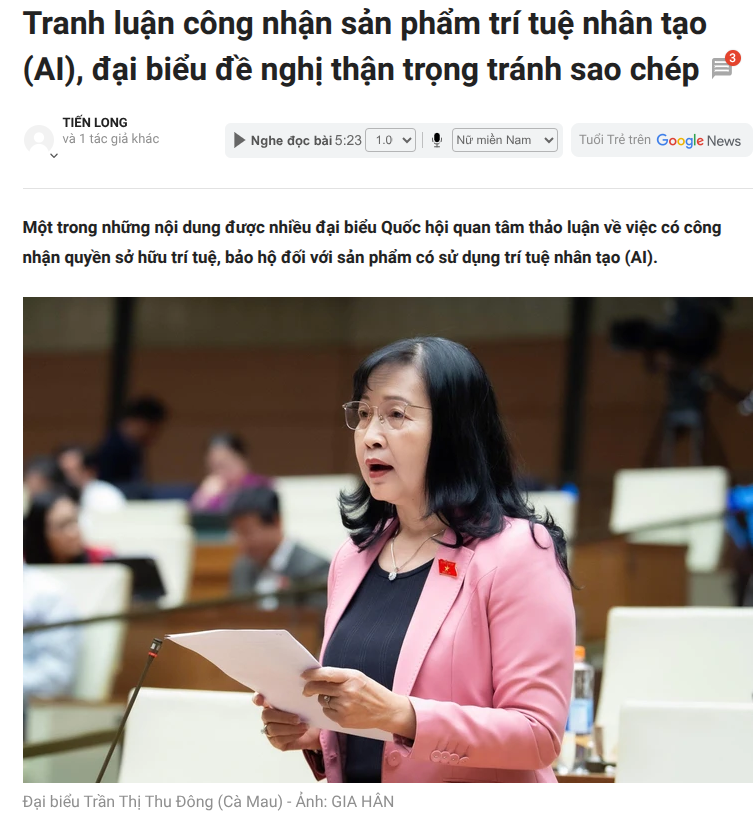

## Mở đầu

Sự bùng nổ của AI gần đây đã buộc tôi phải lục tìm lại ký ức về 'Hồn ma của Karl Marx' — một tác phẩm của Ronan de Calan mà tôi từng tâm đắc. Đằng sau những trang sách về cuộc cách mạng công nghiệp hơi nước là một bài học đắt giá về sự dịch chuyển của các tư liệu sản xuất. Đứng trước ngưỡng cửa của kỷ nguyên tự động hóa, việc nhìn nhận AI qua lăng kính của Chủ nghĩa Marx không chỉ là một bài tập tư duy thú vị, mà còn là cách để chúng ta định vị bản thân trong một xã hội đang biến đổi. Liệu chúng ta đang chứng kiến sự giải phóng sức lao động, hay chỉ đơn giản là đang lặp lại bi kịch của những người thợ dệt năm xưa trong một hình hài kỹ thuật số?

Rất cảm ơn tác giả **chanhndh** đã dịch cuốn sách này, các bạn có thể đọc bản gốc tại [Spiderum](https://spiderum.com/bai-dang/DICH-Hon-ma-cua-Karl-Marx-Ronan-de-Calan-9nu).

## Những người nông dân Schlesien

Đối với những bạn chưa đọc cuốn sách này, mình sẽ tóm tắt lại về diễn biến của người nông dân Schlesien như sau:

Câu chuyện về những người nông dân Schlesien không bắt đầu bằng những con số hay định nghĩa khô khan, mà bằng tiếng bước chân mệt mỏi trên những con đường dẫn vào thành phố.

Thuở đầu, Schlesien hiện ra như một bài thơ về sự tự chủ. Ở đó, mỗi người nông dân là một thực thể tự do, họ sở hữu mảnh ruộng, hạt giống và cả thành quả lao động của mình—những gì mà sau này chúng ta gọi là tư liệu sản xuất. Nhưng sự tự do ấy sớm bị bóp nghẹt bởi một thực thể vô hình mang tên "Quy luật thị trường". Khi người thương nhân từ chối mua ngũ cốc vì máy móc hiện đại ở Westfalen đã tạo ra những sản phẩm rẻ hơn, người nông dân Schlesien bất ngờ nhận ra: Sự cần cù của đôi tay không còn là đối trọng xứng tầm với sự tiến bộ của kỹ thuật.

Cứ thế, một vòng xoáy nghiệt ngã bắt đầu. Để sinh tồn, họ bán đi mảnh đất, bán đi ngôi nhà—những điểm tựa cuối cùng của một người tự do—để rồi dạt vào thành phố với hành trang duy nhất là chiếc máy xe sợi cũ kỹ. Đây chính là khoảnh khắc của một cuộc chuyển giao đau đớn: từ những nông dân tự doanh, họ trở thành những người thợ dệt thủ công, cố gắng dùng nghề mọn để nuôi hy vọng về một cuộc đời dễ thở hơn.

Nhưng "ma thuật" của thị trường không buông tha họ. Những nhà máy dệt công nghiệp với quy mô khổng lồ xuất hiện, biến những tấm vải dệt tay trở thành món hàng xa xỉ lỗi thời. Đứng trước cổng nhà máy, người nông dân Schlesien năm nào giờ đây đứng chung hàng với những thợ thủ công phá sản, những tiểu chủ thất thế. Trong khoảnh khắc đó, họ chính thức tan biến vào một khối người chung vận mệnh: Giai cấp vô sản. Họ không còn gì để bán ngoài sức lao động của chính mình, và bi kịch thay, ngay cả thứ cuối cùng đó cũng bị đem ra đấu giá ngược. Người ta sẵn sàng trả mức lương thấp đến mức nực cười, thậm chí là sử dụng lao động trẻ em, chỉ để tối ưu hóa cái gọi là "chi phí thị trường".

Khi nỗi tuyệt vọng vượt quá giới hạn của sự chịu đựng, những người thợ dệt đã đứng dậy. Họ không tấn công một con người cụ thể, mà trút cơn giận dữ vào những cỗ máy—thứ mà họ tin rằng đã cướp đi phẩm giá và miếng ăn của mình. Họ đốt kho hàng, đập phá những bộ phận cơ khí vô tri. Nhưng phản ứng của họ, dù mãnh liệt, lại chỉ là tiếng kêu cứu đơn độc trước một hệ thống đã được thiết lập chặt chẽ.

Kết thúc câu chuyện, khi họng súng của quân đội chĩa thẳng vào những người nổi loạn, chúng ta thấy hiện rõ hình hài của Kiến trúc thượng tầng. Từ tên đốc công đến nhà vua, tất cả đều nhân danh một thứ tôn nghiêm duy nhất: Quyền sở hữu tư nhân. Nhà vua không chỉ nã đạn để bảo vệ nhà máy, ông ta nã đạn để bảo vệ trật tự của một xã hội nơi công cụ lao động không thuộc về người trực tiếp tạo ra của cải.

Những người thợ dệt Schlesien đã ngã xuống không phải vì họ lười biếng hay thiếu kỹ năng, mà vì họ đã bị nghiền nát giữa bánh xe lịch sử khi lực lượng sản xuất thay đổi, còn họ thì mãi mãi bị tách rời khỏi những công cụ mới của thời đại.

*Cuộc khởi nghĩa của những người thợ dệt Schlesien*

## Thế nào là một cuộc cách mạng?
Nếu chúng ta nhìn nhận một cuộc cách mạng chỉ qua những con số tăng trưởng hay sự tiện lợi, chúng ta đã bỏ lỡ phần đau đớn nhất của nó.

Karl Marx từng chỉ ra rằng:
> Những thời đại kinh tế khác nhau không phải ở chỗ chúng sản xuất ra cái gì, mà là ở chỗ chúng sản xuất bằng cách nào, với những tư liệu lao động nào.
>
> Karl Marx

Nhưng đằng sau câu nói ấy là một thực tại nghiệt ngã: mỗi lần công cụ lao động thay đổi, là một lần trật tự thế giới bị đập đi xây lại trên lưng những người lao động cũ. Một cuộc cách mạng thực thụ không chỉ là sự tiến bộ kỹ thuật; nó là một cuộc tái cấu trúc quyền lực.

Hãy nhìn lại động cơ hơi nước. Nó không đơn giản là "thay thế" đôi tay thợ dệt. Nó tước đoạt đi phẩm giá và vốn liếng duy nhất của họ. Lịch sử đã thực hiện một cuộc thanh lọc tàn nhẫn: nó biến những nghệ nhân tự do thành những "phụ tùng" cho máy móc, hoặc gạt họ ra lề xã hội nếu họ không chịu khuất phục trước hệ thống mới.

Sự xuất hiện của những nghề mới như kỹ sư hay thợ sửa máy thời đó không phải là một "cánh cửa mở" cho tất cả. Đó là một đặc quyền của những kẻ có điều kiện để tiếp cận công nghệ mới. Trong khi đó, phần đông những người thợ thủ công đã phải chứng kiến cuộc đời mình sụp đổ chỉ vì họ không thể — và không nên — bị ép phải nhanh như một cỗ máy vô tri.

Ở cuộc cách mạng AI hiện tại, dường như chúng ta đang đi qua đúng cung đường đó một lần nữa.

AI, thực chất, chính là "động cơ hơi nước" của trí tuệ. Nó đang len lỏi vào cách chúng ta viết code, cách chúng ta thiết kế hay viết lách. Thay vì ngồi gõ từng dòng lệnh hay vẽ từng nét cọ theo cách truyền thống, những ngành nghề mới như Prompt Engineer hay Labelling Engineer đang xuất hiện như một lẽ tất yếu.

Họ không trực tiếp làm ra sản phẩm theo cách cũ, mà họ đóng vai trò là những người "vận hành" bộ não nhân tạo. Với AI, một sản phẩm chất lượng giờ đây có thể được hoàn thiện trong thời gian ngắn kỷ lục. Sự dịch chuyển này đang lặng lẽ chia thế giới thành hai nửa: một bên là những người đang cảm thấy mình dần trở nên dư thừa vì công nghệ, và một bên là những người đang học cách biến công nghệ thành một phần mở rộng của tư duy mình.

Hóa ra, cách mạng không phải là sự thay thế con người, mà là sự thay đổi cách con người chứng minh giá trị của mình trước những công cụ mới.

## Những "hồn ma" trên bàn phím

Tiếng súng ở Schlesien năm 1844 đã tắt, nhưng nỗi bất lực của những người thợ năm ấy dường như đang tái hiện trong cái click chuột của những họa sĩ, những nhà thiết kế hôm nay. Họ không chỉ đang đối đầu với một phần mềm; họ đang đối đầu với một hệ thống đang tìm cách vô hiệu hóa chính họ.

### Cuộc "Tích lũy nguyên thủy" và nghịch lý của sự sáng tạo
Trong chủ nghĩa duy vật lịch sử, <abbr title="Giai đoạn tước đoạt một lượng lớn tư liệu sản xuất từ người lao động sang tay thiểu số tư bản">Tích lũy nguyên thủy</abbr> là giai đoạn kẻ mạnh dùng quyền lực để tước đoạt tư liệu sản xuất của người yếu (như rào dậu cướp đất rừng của nông dân).

Ngày nay, một cuộc "cướp đất" tương tự đang diễn ra trên không gian số. Những cỗ máy AI như Midjourney không tự nhiên mà thông minh; chúng "giỏi" lên nhờ hấp thụ hàng tỷ bức tranh — kết quả của hàng đời nghệ sĩ chắt chiu sáng tạo.

Đây là một sự trớ trêu đau đớn: AI dùng chính "chất xám" bị tước đoạt của nghệ sĩ để tạo ra sản phẩm, rồi quay lại cạnh tranh và đẩy chính những nghệ sĩ đó vào con đường phá sản. Đó không phải là quy luật thị trường tự nhiên; đó là một sự chiếm hữu bất công về quyền sở hữu trí tuệ (IP).

### Sự "Tha hóa" và nỗi đau bị phủ nhận
Marx nói về sự tha hóa khi con người không còn thấy mình trong sản phẩm mình làm ra. Nhưng với Artist hiện đại, sự tha hóa này còn đáng sợ hơn. Khi một bản thiết kế được "prompt" ra trong 3 giây, toàn bộ quá trình tư duy, rung cảm và kỹ thuật của con người bị hệ thống xem là "phí phạm" và "đắt đỏ".

Và rồi tên thương nhân năm xưa lại đến và nói: "Giá của các người quá đắt! AI của tôi rẻ hơn". Câu nói này không chỉ là một lời mặc cả; nó là một sự phủ nhận toàn bộ giá trị con người. Những người làm sáng tạo đang rơi vào một trạng thái bất lực thực sự: Sản phẩm của họ bị lấy đi để huấn luyện máy, và rồi cái máy đó lại được dùng để thay thế họ.

## Dự luật AI

*Tranh luận công nhận sản phẩm trí tuệ nhân tạo, Nguồn: Báo tuổi trẻ*

> Toàn bộ những quan hệ sản xuất ấy hợp thành cơ cấu kinh tế của xã hội, tức là cái cơ sở thực tế trên đó xây dựng lên một kiến trúc thượng tầng pháp lý và chính trị, và những hình thái ý thức xã hội nhất định tương ứng với cơ sở thực tế đó. Phương thức sản xuất đời sống vật chất quyết định các quá trình sinh hoạt xã hội, chính trị và tinh thần nói chung.
>
> Karl Marx

Nói một cách thực tế hơn, Marx đang chỉ ra rằng: Cách chúng ta kiếm tiền và công cụ chúng ta dùng để làm việc (AI) chính là cái nền móng. Còn luật pháp, bản quyền hay những tranh luận tại nghị trường mà chúng ta đang thấy chính là cái nhà xây trên cái nền đó.

Khi cái móng AI đã thay đổi quá nhanh — từ việc một bức tranh được vẽ bằng tay sang việc được 'huấn luyện' từ hàng tỷ dữ liệu — thì cái nhà (Luật Sở hữu trí tuệ) cũ kỹ không còn đứng vững được nữa. Nó buộc phải nứt vỡ, phải sửa sang, thậm chí là phải đập đi xây lại để không bị đổ sụp trước sức mạnh của công nghệ."

Nếu câu chuyện của những người thợ dệt Schlesien kết thúc bằng bạo lực để bảo vệ quyền sở hữu nhà máy, thì ngày nay, cuộc chiến đó đã chuyển dời về bàn nghị trường. Đây chính là lúc chúng ta thấy rõ nhất cái gọi là "Kiến trúc thượng tầng" (luật pháp) đang phải loay hoay như thế nào để đuổi kịp những thay đổi chóng mặt của "Hạ tầng" (công nghệ).

Trong những phiên thảo luận về Luật Sở hữu trí tuệ gần đây tại Việt Nam, sự giằng co này hiện lên không thể rõ ràng hơn.

Ở một phía, có những góc nhìn đầy thận trọng như của đại biểu Trần Thị Thu Đông. Bà xoáy thẳng vào một thực tế khô khốc: chúng ta đang biến lao động sáng tạo thành "nguồn tài nguyên miễn phí" cho máy móc. Nếu nhìn qua lăng kính của Marx, đây chính là một cuộc tước đoạt tư liệu sản xuất kiểu mới. Dữ liệu của nghệ sĩ bị thu thập để huấn luyện AI mà họ không hề hay biết, để rồi chính cái máy đó quay lại cạnh tranh với họ trên thị trường. Nó không còn là câu chuyện về "tiến bộ", mà là câu chuyện về việc ai đang bị chiếm dụng giá trị thặng dư.

Ngược lại, đại biểu Phạm Trọng Nghĩa lại đại diện cho một tư duy thực dụng hơn: Nếu không công nhận sản phẩm AI, chúng ta sẽ tự gạt mình ra khỏi cuộc chơi toàn cầu. Ông đề nghị một lối đi là bảo hộ sản phẩm AI nhưng phải gắn với người vận hành. Điều này thực chất là nỗ lực định danh cho một giai cấp mới—những người không còn làm việc theo cách thủ công, mà sử dụng AI như một công cụ sản xuất chủ đạo. Họ cần một hành lang pháp lý để hợp pháp hóa quyền lực của mình đối với công cụ đó.

Cuộc tranh luận giữa việc "bảo vệ bản quyền nghệ sĩ" hay "thúc đẩy đầu tư AI" thực chất là một cuộc mặc cả về lợi ích kinh tế giữa các tầng lớp xã hội.

Lịch sử vốn dĩ tàn nhẫn và luật pháp thường sẽ nghiêng về phía nào mang lại năng suất cao hơn. Nhưng bi kịch ở Schlesien là một bài học nhãn tiền: Khi luật pháp chỉ mải mê bảo vệ quyền lợi của những người sở hữu cỗ máy mà bỏ mặc những người tạo ra "nguyên liệu" cho nó, sự tha hóa sẽ đạt đến đỉnh điểm. Chúng ta không thể kỳ vọng một nền kinh tế sáng tạo phát triển trên gốc rễ của sự chiếm đoạt.